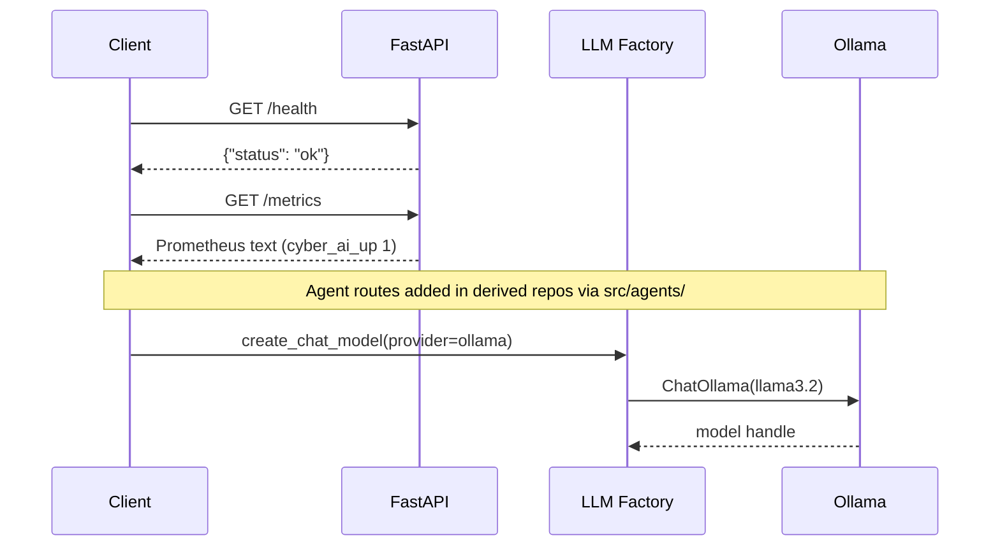

# Cyber AI Project Template


> **Production-grade scaffold for security AI agents** — multi-provider LLM factory, Ollama + Chroma Docker stack, FastAPI observability stubs, and CI. The foundation every repo in this portfolio was forked from.

---

## Problem Statement

Building a security AI agent from scratch means re-solving the same problems every time: LLM provider abstraction, Docker orchestration, health endpoints, mock-LLM test harnesses, and folder conventions. Teams waste sprint cycles on boilerplate before writing a single `@tool` decorator. This template eliminates that tax — clone, add agents, ship.

---

## Why This Architecture

A monolithic "batteries included" framework would force every project into the same agent pattern. Instead, this template provides **infrastructure only** (compose, LLM factory, API shell) and leaves agent logic to derived repos. Compared to LangServe or a raw FastAPI stub, you get Ollama init sidecars, Chroma persistence, Prometheus metrics hooks, and a `StrEnum`-driven provider switch — without committing to LangGraph vs CrewAI vs ADK upfront. Each portfolio repo adds exactly one pattern on top.

---

## Architecture

```mermaid
flowchart TB
  subgraph Docker["Docker Compose Stack"]
    App[FastAPI App :8080]
    Ollama[Ollama :11434]
    Init[ollama-init sidecar]
    Chroma[ChromaDB :8000]
  end
  App --> Factory[src/llm/factory.py]
  Factory --> Ollama
  App --> Metrics[/metrics Prometheus stub]
  App --> Health[/health]
  Chroma -.->|ready for RAG repos| App
  Init -->|pull llama3.2 + nomic-embed| Ollama
```

---

## Agent Flow



---

## Design Patterns

| Pattern | Where Used | Why | Alternative Considered |
|---------|------------|-----|------------------------|
| Multi-provider LLM Factory | `src/llm/factory.py` | Swap Ollama/OpenAI/Gemini via env without code changes | Hard-coded ChatOpenAI |
| Ollama Init Sidecar | `docker/docker-compose.yml` | Auto-pull models on first `compose up` | Manual `ollama pull` |
| Prometheus Metrics Stub | `src/api/main.py` `/metrics` | Observability hook for production deploys | No metrics endpoint |
| Empty Agent/Tool Packages | `src/agents/`, `src/tools/` | Convention-over-configuration for forks | Single-file scripts |
| Multi-stage Dockerfile | `docker/Dockerfile` | Smaller prod images | Single-stage build |

---

## Tech Stack

| Layer | Technology | Purpose |
|-------|------------|---------|
| Runtime | Python 3.11 | Agent and API code |
| API | FastAPI + Uvicorn | HTTP surface, OpenAPI docs |
| LLM | LangChain + Ollama (llama3.2) | Chat model abstraction |
| Embeddings | nomic-embed-text (via Ollama init) | Ready for RAG repos |
| Vector DB | ChromaDB 0.5 | Persistent vector store volume |
| UI (stub) | Streamlit | Placeholder `src/ui/streamlit_app.py` |
| Quality | pytest (12 tests) + ruff | CI gate, no API keys needed |
| Infra | Docker Compose (4 services) | Local prod-parity stack |

---

## Quickstart

```bash
cp .env.example .env
docker compose -f docker/docker-compose.yml up --build
```

Verify the stack:

```bash
curl http://localhost:8080/health
# {"status":"ok"}

curl http://localhost:8080/metrics
# cyber_ai_up 1
# cyber_ai_requests_total 0
```

> **Note:** This template exposes `/health` and `/metrics` only. Derived repos add `POST /api/v1/agent/run`.

---

## Demo Data

| Path | Contents | Generation |
|------|----------|------------|
| `demo-data/processed/` | Gitignored — for derived repos | `scripts/seed_demo_data.py` (placeholder prints instructions) |
| `scripts/seed_demo_data.py` | Scaffold script | Extend per domain in forked repos |

No committed demo corpus — intentional. Fork this template, add `demo-data/`, wire `src/agents/`.

---

## Evaluation & Metrics

| Metric | Value | Notes |
|--------|-------|-------|
| Unit tests | **12** (`tests/test_llm_factory.py`) | Provider parsing + mocked model creation |
| CI pipeline | ruff + pytest + Docker smoke | GitHub Actions on every push |
| LLM factory coverage | Ollama, OpenAI, Gemini, Mock | `USE_MOCK_LLM=true` in CI |
| Target latency | N/A (no agent route) | Health check < 50ms |

---

## System Design Highlights

- **Richest compose stack in the portfolio** — 4 services with Ollama model auto-pull and Chroma persistence volume
- **Exhaustive `StrEnum` provider switch** with `never` default — new providers fail at compile time
- **Intentionally agent-free** — zero domain logic; pure infrastructure for 10 derived security repos
- **Prometheus-ready** metrics endpoint for Grafana/Alertmanager integration
- **12-test CI harness** validating LLM factory without GPU or cloud API keys

---

## Video Demo

- **Walkthrough:** [`demos/WALKTHROUGH.md`](demos/WALKTHROUGH.md) — step-by-step demo with captured live output
- **Captured JSON:** [`demos/captured/response.json`](demos/captured/response.json)
- Record your 2-min Loom using `python scripts/run_demo.py` (works offline with `USE_MOCK_LLM=true`)

### Live Demo Output

```json
{
  "health": {
    "status": "ok"
  },
  "llm_provider": "ollama"
}
```

> Full trace and request payloads in [`demos/captured/`](demos/captured/). See [`demos/RECORDING_SCRIPT.md`](demos/RECORDING_SCRIPT.md) for narration cues.

---

## Security & Ethics

- **Synthetic data only** in derived repos — this template ships no offensive tooling
- No network scanning, no live target interaction
- See [SECURITY.md](SECURITY.md) for responsible disclosure and usage boundaries
